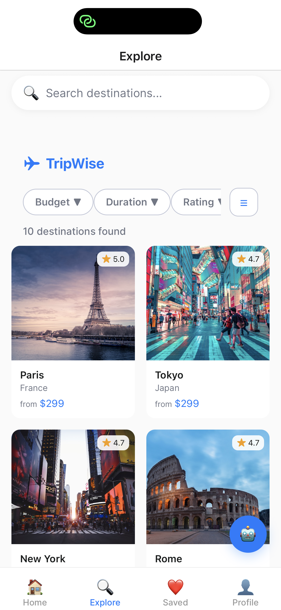
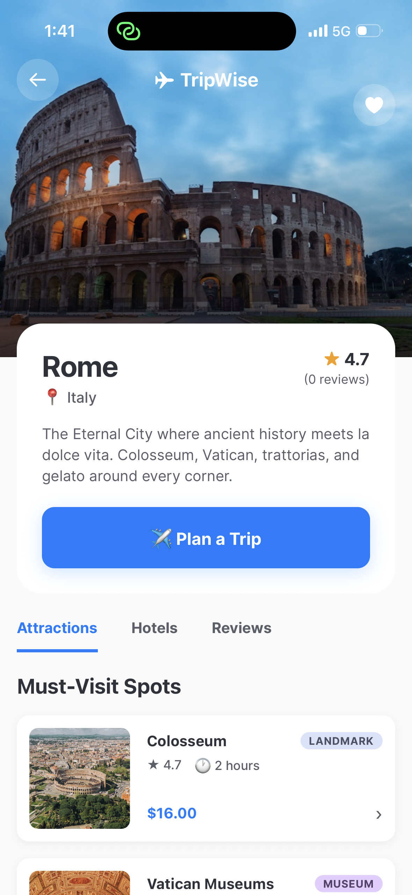
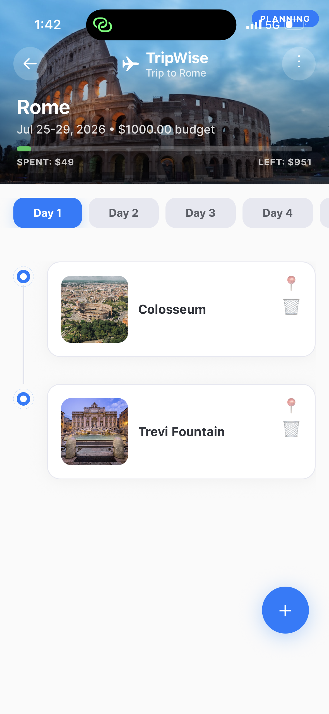
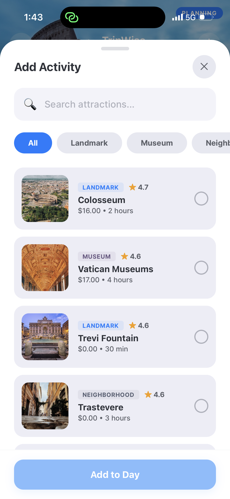

# ✈️ TripWise

### Full-Stack AI-Powered Travel Planning Mobile App

A production-oriented full-stack mobile application built for **discovering destinations, planning trips, managing daily itineraries, and generating AI-powered travel plans** — turning wanderlust into organized adventures.

This project demonstrates **secure authentication, real-time trip collaboration, AI-generated itineraries, budget tracking, interactive maps, and a polished mobile-first UX** — not just a destination browser.

---

## 🎯 Project Purpose

Planning a trip often means juggling multiple apps — browsing destinations, manually creating day-by-day schedules, tracking spending, and sharing plans with travel companions.

**TripWise** centralizes the entire travel planning workflow by allowing users to:

- browse 10+ destinations with detailed attractions, hotels, and reviews
- create custom trips with date ranges and budgets
- build day-by-day itineraries with a visual timeline
- add activities from destination attractions or manually
- track spending against budget with real-time progress bars
- generate complete itineraries using AI-powered natural language chat
- save favorite destinations to a wishlist with interactive map view
- share trip details via email, WhatsApp, or clipboard

The system was built to simulate **real-world mobile product requirements** — authentication, API-driven data, state management, third-party AI integration, and polished UX — while keeping the travel experience at the center.

---

## 🚀 Core Features

### Mobile Experience

- **Destination Browser** — scroll through 10+ destinations with category filters, search, and grid/list view toggle
- **Destination Detail** — explore attractions, hotels, and reviews with image galleries and Google Maps integration
- **Wishlist** — save and manage favorite destinations with list and interactive map views
- **User Profile** — view trip stats, manage settings, dark mode toggle, and account management
- **Onboarding** — three-slide animated introduction with parallax backgrounds

### Trip Management

- **Trip Builder** — visual day-by-day timeline with drag-reorderable activities
- **Day Selector** — horizontal scrollable day tabs with per-day activity timelines
- **Activity Management** — add activities by searching attractions or manual entry with time, notes, and cost
- **Budget Tracking** — real-time progress bar showing spent vs remaining budget with color thresholds (green / orange / red)
- **Edit & Share** — edit trip name/budget, share via clipboard/email/WhatsApp, delete trips
- **Activity Delete** — tap trash icon on any activity card to remove it with confirmation
- **Google Maps Integration** — tap any attraction or activity to open its location in Google Maps

### AI Integration

- **AI Trip Planner** — natural language chat interface for generating complete itineraries
- **Conversational AI** — asks clarifying questions, understands context, remembers conversation history
- **Automatic Itinerary Parsing** — detects when a trip plan is requested and renders structured day-by-day cards
- **Full Itinerary Modal** — expand AI-generated plans to see daily activities, meals, and costs
- **OpenAI GPT-4o-mini** — powers intelligent trip generation with destination-specific recommendations

### Authentication & Data

- **Email/Password Auth** — register and login with bcrypt-hashed credentials
- **Google OAuth** — one-tap sign-in with Google identity platform
- **JWT Sessions** — 7-day token-based authentication with secure storage
- **PostgreSQL Database** — 11 tables with relational joins, indexes, and cascading deletes
- **Seeded Content** — 10 destinations, 50+ attractions, 20+ hotels with real imagery

---

## 🌐 Live Demo

- **Backend API:** [https://tripwise-app.fly.dev/api/health](https://tripwise-app.fly.dev/api/health)
- **Android APK:** [Download](https://expo.dev/accounts/misho_1019/projects/tripwise/builds/7f433ddf-b5f3-4845-95ae-80c6784690a9)

> The backend is deployed on Fly.io and is always-on. The Android APK can be installed directly on any Android device.

---

## 🖼️ Screenshots

### 1️⃣ Screenshots

<p float="left">
  
  
  
</p>

<p float="left">
  
  
</p>

<p float="left">
  
  
</p>

---

## 🏗️ Architecture Overview

The application follows a classic client–server architecture with a monorepo layout.

```
┌─────────────────────────────────────────────────┐
│              React Native (Expo 54)              │
│  Expo Router + Zustand + TanStack React Query   │
│            react-native-maps + Reanimated       │
└────────────────────┬────────────────────────────┘
                     │ REST + WebSocket
┌────────────────────▼────────────────────────────┐
│              Express 5 + TypeScript              │
│       Routes → Zod Validation → pg Pool         │
│    JWT Auth Middleware + Rate Limiting           │
├────────────────┬───────────────┬────────────────┤
│                │               │                │
┌──▼──────────┐ ┌▼────────┐ ┌───▼──────┐  ┌─────▼─────┐
│  Neon (PG) │ │ OpenAI  │ │ Socket.IO│  │ Cloudinary │
│  (DB)      │ │ (GPT-4o)│ │ (realtime│  │ (images)   │
└────────────┘ └─────────┘ └──────────┘  └───────────┘
```

### Key Layers

**Client Layer (React Native + Expo SDK 54)**
- 20+ screens across 9 route groups with Expo Router file-based navigation
- Zustand stores for auth and UI state management
- TanStack React Query for server state caching and auto-invalidation
- Reanimated 4 for animated transitions, parallax effects, and timeline dots
- react-native-maps for interactive wishlist map with custom markers
- Axios client with automatic JWT token injection and 401 handling

**API Layer (Express 5 + TypeScript)**
- 20+ RESTful endpoints across 6 route modules
- Zod validation on all mutation endpoints
- JWT authentication middleware with Bearer token verification
- Express rate limiting (100 requests per 15-minute window)
- Google OAuth2 token verification for social login

**Data Layer (PostgreSQL + pg)**
- 11 tables: users, destinations, categories, attractions, hotels, trips, trip_days, trip_activities, saved_destinations, reviews, destination_categories
- Junction tables for many-to-many relationships (destination ↔ category)
- Full-text search on destination name and country
- Composite indexes for performant joins

**Real-Time (Socket.IO)**
- Room-based trip collaboration for shared itinerary editing
- Broadcast trip-changed events to all connected clients

---

## 🛠️ Tech Stack

### Frontend

| Technology | Purpose |
|-----------|---------|
| React Native 0.81 | Mobile UI framework |
| Expo SDK 54 | Development platform & native modules |
| TypeScript 5.9 | Type safety |
| Expo Router 6 | File-based routing (9 routes, 20+ screens) |
| Zustand 5 | Client-side state management (auth, UI) |
| TanStack React Query 5 | Server state caching & mutations |
| Reanimated 4 | Animations & parallax effects |
| react-native-maps | Interactive map with markers & callouts |
| Axios | HTTP client with interceptors |
| Lottie | Animated illustrations |
| Draggable FlatList | Drag-reorder for trip activities |
| Expo Secure Store | Secure JWT token persistence |

### Backend

| Technology | Purpose |
|-----------|---------|
| Node.js 22 | Runtime |
| Express 5 | HTTP framework |
| TypeScript 5.6 | Type safety |
| PostgreSQL (pg) | Database driver with connection pooling |
| Neon | Serverless PostgreSQL |
| JSON Web Token | Bearer token authentication (7-day expiry) |
| bcryptjs | Password hashing (10 rounds) |
| Zod | Request validation schemas |
| Socket.IO | Real-time trip collaboration |

### AI & APIs

| Technology | Purpose |
|-----------|---------|
| OpenAI GPT-4o-mini | AI trip itinerary generation |
| Google OAuth2 | Social authentication |
| Google Maps API | Map markers and location search |
| Nodemailer | Password reset emails |

### Database & Deployment

| Technology | Purpose |
|-----------|---------|
| Neon | Cloud PostgreSQL (always-on, pooled) |
| Fly.io | Backend deployment (always-on, no cold starts) |
| EAS Build | Android APK distribution |

---

## 🔒 Security Considerations

- **JWT-based authentication** with 7-day bearer tokens
- **Password hashing** via bcrypt with 10 salt rounds
- **Request validation** via Zod schemas on all mutation endpoints
- **SQL injection prevention** via parameterized queries ($1, $2, ... syntax)
- **Rate limiting** — 100 requests per 15-minute window across all endpoints
- **CORS** — configured for mobile app origins
- **Environment variables** for all sensitive configuration (JWT secret, database URL, API keys)
- **Google OAuth token verification** — server-side ID token validation
- **Input sanitization** — Zod string trimming and length constraints

---

## ▶️ Running Locally

### Prerequisites

- Node.js 20+
- Expo CLI (`npm install -g expo-cli`)
- A Neon PostgreSQL database (free at [neon.tech](https://neon.tech))
- An OpenAI API key ([platform.openai.com](https://platform.openai.com))

### 1️⃣ Clone & Install

```bash
git clone <repo-url>
cd tripwise-app

# Install backend dependencies
cd backend && npm install

# Install mobile dependencies
cd ../mobile && npm install
```

### 2️⃣ Set up environment variables

```bash
cp backend/.env.example backend/.env
# Edit backend/.env with your database URL, JWT secret, API keys
```

### 3️⃣ Seed the database

```bash
cd backend
npm run db:migrate
npm run db:seed
```

### 4️⃣ Start the backend

```bash
cd backend
npm run dev
```

### 5️⃣ Start the mobile app

```bash
cd mobile
npx expo start
```

Scan the QR code with Expo Go (Android) or the Camera app (iOS) — the app is fully functional.

---

## ⚙️ Environment Variables

### Backend (`backend/.env`)

| Variable | Required | Default | Description |
|----------|:--------:|---------|-------------|
| `DATABASE_URL` | Yes | — | Neon PostgreSQL connection string |
| `JWT_SECRET` | Yes | — | Token signing secret |
| `OPENAI_API_KEY` | Yes | — | OpenAI API key for AI planner |
| `GOOGLE_CLIENT_ID` | Yes | — | Google OAuth client ID |
| `GOOGLE_CLIENT_SECRET` | Yes | — | Google OAuth client secret |
| `CLOUDINARY_CLOUD_NAME` | No | — | Cloudinary image upload config |
| `CLOUDINARY_API_KEY` | No | — | Cloudinary API key |
| `CLOUDINARY_API_SECRET` | No | — | Cloudinary API secret |
| `SMTP_EMAIL` | No | — | Email sender for password resets |
| `SMTP_PASSWORD` | No | — | SMTP account password |
| `PORT` | No | `3000` | Server port |

### Mobile (`mobile/.env`)

| Variable | Required | Default | Description |
|----------|:--------:|---------|-------------|
| `EXPO_PUBLIC_API_URL` | Yes | `http://localhost:3000/api` | Backend API URL |
| `EXPO_PUBLIC_GOOGLE_CLIENT_ID` | Yes | — | Google OAuth client ID |

---

## 👤 Author Note

Built with a production mindset, focusing on real-world mobile product requirements — authentication, API integration, state management, AI-powered features, and polished mobile UX.

This project demonstrates applied full-stack mobile engineering with **OpenAI integration, interactive maps, real-time budget tracking, animated UI components, and cloud deployment** — reflecting real production scenarios beyond basic CRUD screens.

---

Built by [Mihail Todorov](https://github.com/Misho-1019)
